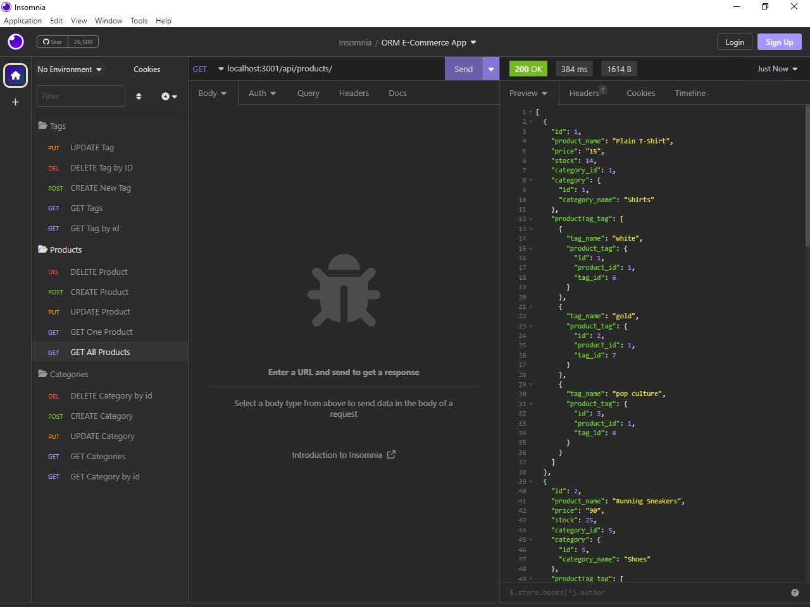

# ORM-E-Commerce-App

  
  

## Description:
	E-Commerce_Back-End-App

## Table of Contents
- [Deployment URL:](#Deployment-URL)
- [Repository URL:](#Repository-URL)
- [Features:](#Features)
- [Pre-Requisites:](#Pre-Requisites)
- [Installation:](#Installation)
- [Usage:](#Usage)
- [Screenshot:](#Screenshot)
- [Walkthrough Video:](#Walkthrough-Video)
- [Technologies Used:](#Technologies-Used)
- [License:](#License)

### Deployment URL:
As a backend application, the majority of the functionality is accessed in real time, and as such, it has not yet been deployed.

### Repository URL:
https://github.com/naser421/ORM-E-Commerce-App

## Features:
- Robust back-end.
- Improved functionality.

## Pre-Requisites:
- Install `node.js`.
- Install `MySQL`

## Installation:
- Download or Clone this particular repository.
- In the event that you opt to download the zipped version of this repository, then unzip it in your desired directory.
- Go to the command line (that is if you are not there yet).
- Navigate to your unzipped directory.
- Run: `npm install`.
- Create a `.env` in the root directory of the application.
- Create the following three variables in the `.env` file:
   - `DB_NAME=ecommerce_db`
   - `DB_USER=`[your MySQL username]
   - `DB_PW=`[your MySQL password]
- Open `MySQL` Command terminal.
- Run `source db/schema.sql` to create the database.
- Optionally navigate back to the regular command-line and run: `npm run seeds` to seed the databse.

## Usage:
- Run: `npm start`.
- Open Insomnia application.
- Make API requests as demonstrated in the video (linked below).

### Screenshot:

### Walkthrough Video:
[Walkthrough 1](https://user-images.githubusercontent.com/118908200/217869256-5e30e748-9690-459b-a06f-5afbd0b2f9a0.mp4)
[Walkthrough 2](https://user-images.githubusercontent.com/118908200/217876996-4c98ed9b-1d14-47ae-8942-fd91f4ff4d9e.webm)

## Technologies Used:
- [JavaScript](https://img.shields.io/badge/Javascript-yellow)
- [Node.js](https://nodejs.org/en/)
- [Express.js](https://www.npmjs.com/package/express)
- [MySQL2](https://www.npmjs.com/package/mysql2)
- [Sequelize](https://www.npmjs.com/package/sequelize)
- [Dotenv](https://www.npmjs.com/package/dotenv)

## License:
This project is licensed under the terms of the [MIT](https://opensource.org/licenses/MIT) license. 
